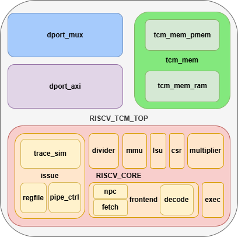

# Модуль riscv_tcm_top

Модуль представляет собой суперскалярный процессор RISC-V с двумя АЛУ с Tightly Coupled Memory, объединяющую:
суперскалярный процессор с двумя АЛУ
- Ядро RISC-V процессора
- Локальную память с интерфейсом AXI
- Подсистему внешнего доступа к памяти через AXI
- Механизмы управления памятью и прерываниями

Тесно связанная память -часть адресуемой памяти, физически расположенной на первом уровне иерархии памяти, рядом с кэш-памятью первого уровня.

# Параметры

| Параметр | Описание |
|----------|----------|
| `BOOT_VECTOR` | Адрес начальной загрузки |
| `CORE_ID` | Идентификатор процессора |
| `TCM_MEM_BASE` | Базовый адрес TCM памяти |
| `SUPPORT_*` | Флаги поддержки различных функций |
| `MEM_CACHE_ADDR_*` | Диапазон адресов кэшируемой памяти |
| `NUM_*_ENTRIES` | Размеры таблиц предсказания переходов |

# Входы и выходы

## Системные сигналы
| Сигнал | Описание |
|--------|----------|
| `clk_i` | Тактовый сигнал |
| `rst_i` | Сигнал сброса системы |
| `rst_cpu_i` | Сигнал сброса процессора |
| `intr_i[31:0]` | Входы прерываний |

# Подключенные модули

Модуль состоит из четырех основных подмодулей:

## 1. riscv_core

Описание модуля представлено в документе[risc_core.md](/description/riscv_core.md)

Исходный код модуля представлен в [riscv_core.v](/src/core/riscv_core.v)

Ядро процессора, выполняющее инструкции.

## Модуль dport_mux

### Назначение

Исходный код модуля представлен в [dport_mux.v](/src/tcm/dport_mux.v)

Мультиплексор доступа к памяти для процессора, обеспечивающий:
- Маршрутизацию запросов между TCM и внешней памятью
- Управление потоком команд для разных областей памяти
- Согласование интерфейсов доступа

### Ключевые особенности

1. **Два порта**:
   - Доступ к быстрой TCM памяти
   - Доступ к основной внешней памяти
   - Автоматическое определение целевой памяти по адресу

2. **Управление потоком**:
   - Отслеживание невыполненных запросов
   - Блокировка конфликтующих операций
   - Контроль перекрывающихся транзакций

3. **Поддержка всех операций**:
   - Чтение/запись данных
   - Управляющие команды
   - Учет кэшируемости областей

### Основные функции

1. **Маршрутизация запросов**:
   - Определение целевой памяти по адресу
   - Передача всех параметров запроса
   - Распределение управляющих сигналов

2. **Обработка ответов**:
   - Выбор источника данных для чтения
   - Маршрутизация подтверждений и ошибок
   - Возврат тегов ответ

## Модуль tcm_mem

Исходный код модуля представлен в [tcm_mem.v](/src/tcm/tcm_mem.v)

### Назначение
Двухпортовая Tightly Coupled Memory для процессора, обеспечивающая:
- Низколатентный доступ к инструкциям и данным
- Одновременный доступ процессора и внешних устройств через AXI
- Управление памятью с возможностью отладки

### Ключевые особенности

1. **Двухпортовая архитектура**:
   - Порт 0: Доступ только для чтения инструкций (64-бит)
   - Порт 1: Доступ для данных (32-бит) и внешних устройств

2. **Интерфейсы**:
   - Процессорный интерфейс для инструкций и данных
   - Полнофункциональный AXI-интерфейс для внешнего доступа
   - Встроенный преобразователь AXI->PMEM

3. **Особенности реализации**:
   - Разделение 64-битных слов на верхнюю/нижнюю части
   - Приоритет внешнего доступа над доступом данных процессора
   - Поддержка функций отладки в Verilator

### Основные функции

1. **Доступ к инструкциям**:
   - Фиксированная задержка в 1 такт
   - 64-битная шина данных
   - Бесконфликтный параллельный доступ

2. **Доступ к данным**:
   - Поддержка операций чтения/записи
   - Байтовая адресация (wr_i[3:0])
   - Конфликтное управление с внешним доступом

3. **Внешний доступ через AXI**:
   - Поддержка burst-транзакций
   - Полная обработка всех каналов AXI
   - Преобразование в простой интерфейс PMEM

4. **Отладочные функции**:
   - Функции read/write для доступа к памяти из тестов
   - Побайтовый доступ к памяти

## Модуль dport_axi

Исходный код модуля представлен в [dport_axi.v](/src/tcm/dport_axi.v)

### Назначение

Адаптер интерфейса кэша данных к шине AXI, обеспечивающий:
- Преобразование протоколов между dcache_if и AXI4/AXI4-Lite
- Буферизацию транзакций
- Управление потоком данных

### Ключевые особенности

1. **Двунаправленная буферизация**:
   - FIFO для запросов
   - FIFO для тегов ответов
   - Поддержка back-pressure

2. **Управление транзакциями**:
   - Поддержка 1 невыполненного запроса
   - Раздельная обработка чтения/записи
   - Контроль подтверждений операций

3. **Полная поддержка AXI**:
   - Все каналы AXI (чтение, запись, ответы)
   - Обработка ошибок
   - Поддержка AXI-Lite

### Основные функции

1. **Обработка запросов**:
   - Маршрутизация операций чтения/записи
   - Буферизация адресов и данных
   - Управление сигналами готовности

2. **Генерация AXI-транзакций**:
   - Формирование заголовков AXI
   - Синхронизация каналов AW/W
   - Обработка подтверждений

3. **Обработка ответов**:
   - Сопоставление тегов запросов/ответов
   - Передача данных чтения
   - Фильтрация ошибок