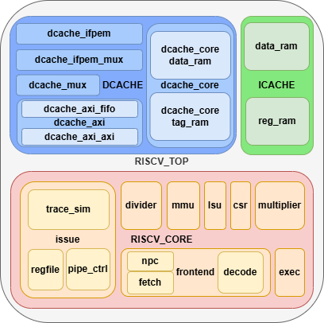

# Модуль riscv_top

Модуль riscv_top представляет собой суперскалярный процессор RISC-V с двумя АЛУ, объединяющей ядро процессора, кэш инструкций и кэш данных с интерфейсом AXI. Этот модуль предназначен для реализации RISC-V совместимого процессора с поддержкой различныхфункций.

## Параметры

| Параметр                  | Описание |
|:-------------------------:|:--------:|
| CORE_ID                   | Идентификатор ядра |
| ICACHE_AXI_ID             | AXI ID для кэша инструкций |
| DCACHE_AXI_ID             | AXI ID для кэша данных |
| SUPPORT_BRANCH_PREDICTION | Включение предсказания переходов |
| SUPPORT_MULDIV            | Поддержка операций умножения/деления |
| SUPPORT_SUPER             | Поддержка привилегированных режимов |
| SUPPORT_MMU               | Поддержка MMU |
| SUPPORT_DUAL_ISSUE        | Поддержка двухпоточной выдачи инструкций |
| SUPPORT_LOAD_BYPASS       | Поддержка обхода (bypass) загрузки |
| SUPPORT_MUL_BYPASS        | Поддержка обхода (bypass) умножения |
| SUPPORT_REGFILE_XILINX    | Использование специализированного регистр-файла Xilinx |
| EXTRA_DECODE_STAGE        | Добавление дополнительной стадии декодирования |
| MEM_CACHE_ADDR_MIN        | Минимальный адрес кэшируемой памяти |
| MEM_CACHE_ADDR_MAX        | Максимальный адрес кэшируемой памяти |
| NUM_BTB_ENTRIES           | Количество записей в BTB (буфере целевых адресов переходов) |
| NUM_BHT_ENTRIES           | Количество записей в BHT (истории переходов) |
| NUM_RAS_ENTRIES           | Количество записей в RAS (стеке возвратов) |
| RAS_ENABLE                | Включение стека возвратов (RAS) |
| GSHARE_ENABLE             | Включение схемы предсказания Gshare |
| BHT_ENABLE                | Включение истории переходов (BHT) |

## Порты

| **Порты**                 | **Описание** |
|:-------------------------:|:------------|
| **Входы**                 | |
| clk_i                     | Системный тактовый сигнал |
| rst_i                     | Системный сигнал сброса |
| axi_i_*                   | AXI-сигналы от кэш-интерфейса инструкций |
| axi_d_*                   | AXI-сигналы от кэш-интерфейса данных |
| intr_i                    | Вход внешнего прерывания |
| reset_vector_i            | Начальный адрес вектора сброса |
| **Выходы**                | |
| axi_i_*                   | AXI-сигналы на кэш-интерфейса инструкций |
| axi_d_*                   | AXI-сигналы на кэш-интерфейса данных |

## Подключенные модули

Модуль состоит из трёх основных подмодулей:

### 1. riscv_core

Описание модуля представлено в документе[risc_core.md](/description/riscv_core.md)

Исходный код модуля представлен в [riscv_core.v](/src/core/riscv_core.v)

Ядро процессора, выполняющее инструкции. Обменивается данными с кэшэм через унифицированный интерфейс:

- **Интерфейсы**:
  - mem_d_* — чтение/запись данных
  - mem_i_* — запросы инструкций

- **Поддерживаемые функции**:
  - Предсказание переходов:
    - BTB (Branch Target Buffer)
    - BHT (Branch History Table)
    - RAS (Return Address Stack)
  - Параллельная выдача инструкций
  - Обход (bypass) для ускорения выполнения

### 2. icache

Исходный код модуля представлен в [icache.v](/src/icache/icache.v)

#### Назначение

Кэш-память инструкций, обеспечивающая:
- Быстрый доступ к часто используемым инструкциям
- Уменьшение задержек при выборке команд
- Снижение нагрузки на системную шину

#### Ключевые особенности

1. **Архитектура кэша**:
   - 2-канальная set-associative организация
   - Размер строки кэша: 32 байта
   - Псевдослучайный алгоритм замещения

2. **Интерфейсы**:
   - Внутренний интерфейс для процессора
   - AXI4-Lite интерфейс для доступа к памяти
   - Поддержка инвалидации и сброса кэша

3. **Производительность**:
   - Однотактный доступ при попадании в кэш
   - Пайплайнинг операций
   - Буферизация запросов

#### Основные функции

1. **Управление кэшем**:
   - Поиск данных по тегам
   - Заполнение строк при промахе
   - Инвалидация отдельных строк или всего кэша

2. **Обработка запросов**:
   - Прием адресов от блока выборки
   - Возврат инструкций или флагов ошибок
   - Управление потоком команд при промахах

3. **Работа с памятью**:
   - Генерация burst-транзакций AXI
   - Обработка ответов от памяти
   - Контроль ошибок доступа

4. **Состояния работы**:
   - Обычный режим
   - Заполнение кэша
   - Повторный поиск
   - Сброс кэша

### 3. dcache

Описание модуля представлено в документе[dcache.md](/description/dcache.md)

Исходный код модуля представлен в [dcache.v](/src/dcache/dcache.v)

Кэш данных, подключенный к axi_d_*.

- **Особенности**:
  - Поддержка кэшируемого и некэшируемого доступа
  - Операции:
    - Инвалидация
    - Сброс
    - Writeback
  - Ускоренный доступ к памяти

- **Ключевые интерфейсы**:
  - mem_d_* — подключение к ядру
  - axi_d_* — AXI-канал данных