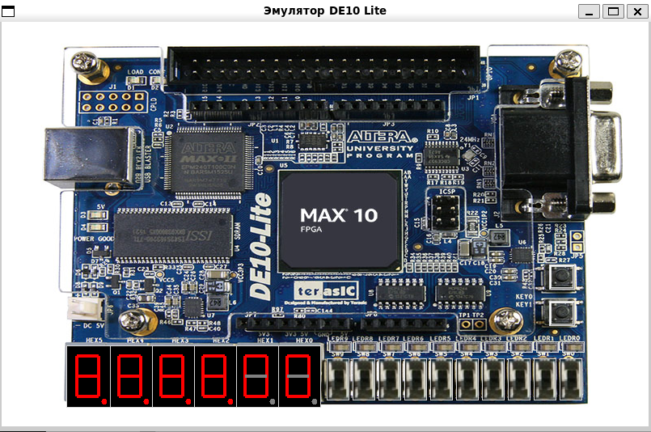

# Виртуальная плата DE10-Lite 



## Описание проекта

Эмулятор платы DE10-Lite с полным функционалом, включая:
- Графический интерфейс пользователя
- Сетевое взаимодействие с Verilog-симуляцией
- 10 переключателей
- 10 светодиодов
- 6 семисегментных индикаторов
- 2 кнопки
- Сохранение и загрузка состояний

## Основные возможности

- Точная эмуляция компонентов платы DE10-Lite
- Интерактивное взаимодействие с Verilog-симуляцией
- Адаптивный интерфейс с масштабированием
- Гибкая система конфигурации
- Сохранение положений переключателей и кнопок между сеансами
- Сброс состояния к значениям по умолчанию

## Требования

### Для графического клиента

- Python 3.6+
- Библиотеки:
  - `tkinter`
  - `Pillow` (PIL)
  - `json`
  - `configparser`

### Для Verilog сервера

- Verilator 4.0+
- Компилятор с поддержкой C++17
- Библиотеки:
  - `libjsoncpp`
  - `pthread`

## Установка

1. Клонируйте репозиторий:
```bash
git clone https://git.miem.hse.ru/1963/virtual_fpga_boards.git
cd virtual_fpga_boards
```

2. Установите зависимости Python:
```bash
pip install pillow
```

3. Соберите сервер:
```bash
make build
```

## Использование

Возможен одновременный запуск через Makefile или запуск графического клиента и сервера по отдельности.
Во втором случае при запуске графического клиента можно ввести параметры расширения окна.

### Запуск через Makefile

```bash
make run
```

### Запуск графического клиента

```bash
python app.py [--width ШИРИНА] [--height ВЫСОТА] [--config ФАЙЛ]
```

Параметры:

--width: Ширина окна в пикселях (переопределяет конфиг)

--height: Высота окна в пикселях (переопределяет конфиг)

--config: Путь к файлу конфигурации (по умолчанию: config.ini)

### Файл конфигурации

Отредактируйте config.ini для настройки размеров окна:

```ini
[DEFAULT]
width = 800
height = 500
```

### Запуск сервера

```bash
./server
```
### Функционал графического интерфейса

- Переключатели: 10 переключателей, которые можно включать и выключать. Их состояние сохраняется между сеансами.
- Кнопки: 2 кнопки, которые остаются "нажатыми" после клика и возвращаются в исходное состояние при повторном клике.
- Светодиоды: 10 светодиодов, отображающих состояние.
- Семисегментные индикаторы: 6 индикаторов, отображающих значения.
- Кнопка "Save": Сохраняет текущее состояние переключателей и кнопок в файл state.pkl.
- Кнопка "Load": Загружает сохраненное состояние из файла state.pkl.
- Кнопка "Reset": Сбрасывает состояние переключателей и кнопок к значениям по умолчанию.

## Makefile

Доступные команды:

| Команда          | Описание                                                                 |
|------------------|--------------------------------------------------------------------------|
| `make`           | Показывает справку по доступным командам                                |
| `make build`     | Собирает проект (верилирует Verilog и компилирует C++ код)              |
| `make run`       | Собирает и запускает сервер                                             |
| `make clean`     | Удаляет все сгенерированные файлы сборки                                |
| `make check_python` | Проверяет версию Python (должна быть 3.6+)                          |

## Таблица сигналов

На виртуальной плате DE10-Lite загружено 8-битное АЛУ, которое поддерживает арифметические и логические операции. Ниже приведено описание сигналов, подключенных к элементам платы.

| **Сигнал**         | **Описание**                              | **Подключение**                     |
|---------------------|------------------------------------------|--------------------------------------|
| `alu_result[7:0]`  | Результат работы АЛУ                     | LEDR0-LEDR7, HEX0-HEX1              |
| `alu_cout`         | Перенос (Carry Out)                      | LEDR8                               |
| `a_reg[7:0]`       | Регистр операнда A                      | SW[3:0] и KEY[0] (запись)             |
| `b_reg[7:0]`       | Регистр операнда B                      | SW[3:0] и KEY[0] (запись)            |
| `sel[3:0]`         | Код операции АЛУ                        | SW[7:4]                             |
| `mode`             | Режим работы АЛУ (арифметический/логический) | KEY[1]                              |

